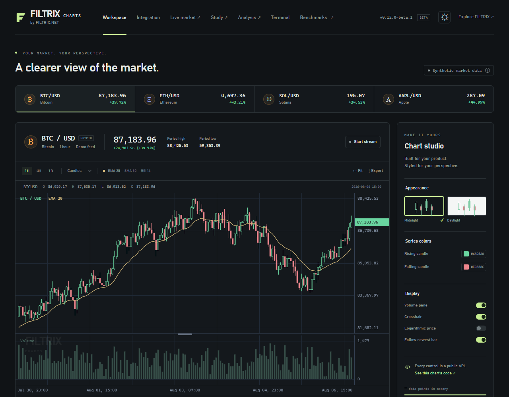

# FILTRIX Charts

**by [FILTRIX.NET](https://filtrix.net)**

An original, embeddable financial charting library for web applications. TypeScript, Canvas 2D, explicit data ownership, and no external runtime dependencies in the chart engine. Use it independently of the FILTRIX product: no account or telemetry service is required.

**Open-source beta `0.12.0-beta.1`, under [Apache-2.0](LICENSE), is available on npm.** Source repository: [FILTRIX-net/filtix-charts](https://github.com/FILTRIX-net/filtix-charts), maintained by `x777`. The SDK uses the `@filtrix.net` npm scope. All nine packages are published with the `beta` tag; the [public demo](https://charts.filtrix.net/) is live. See the [beta guide](docs/OPEN-SOURCE-BETA.md), [release process](docs/RELEASE-PROCESS.md) and [contribution guide](CONTRIBUTING.md).

Four persistent terminal slots support 1/2/4 visible charts and optional synchronization. Saved price alerts monitor their markets independently of the displayed chart through a native editor and workspace v5. Start with the [grid integration guide](docs/TERMINAL-CONTRACT.md#saved-terminal-grids), [alert integration](docs/ALERTS.md) or [drawing tools](docs/DRAWING-TOOLS.md). Comparisons with TradingView require separate equivalent benchmarks.



## Install

```sh
npm install @filtrix.net/charts@0.12.0-beta.1
```

Pin the exact beta version and keep optional SDK peer packages in the same cohort. npm also assigned `latest` to this first beta; an unversioned install can select it. [View the chart package on npm](https://www.npmjs.com/package/@filtrix.net/charts).

## Run the workspace

Use Node 22.22.2+ in the 22.x line, Node 24.15.0+ in the 24.x line, or Node 26+. The lockfile uses npm 12.0.2.

```sh
git clone https://github.com/FILTRIX-net/filtix-charts.git
cd filtix-charts
npx --yes npm@12.0.2 ci
npm run build
npm run dev
```

Open the local address printed by Vite, normally http://127.0.0.1:5173.

The studio includes deterministic synthetic instruments, five chart types, a simulated feed, indicator/pane controls, light/dark themes, colors, a source-data table, PNG export, and copyable integration code. It uses the same public API as consumers.

The live market at `/market.html` adds public Binance Spot history and WebSocket candles, older-history loading, reconnect recovery and explicit source states. See the [datafeed guide](docs/DATAFEED.md).

The study at `/drawings.html` adds editable trend lines, price levels, zones and measurements, undo/redo, and explicitly saved browser-local layouts. See the [drawing guide](docs/DRAWINGS.md).

The analysis workspace at `/analysis.html` links BTC/ETH price views with indexed BTC/ETH/SOL comparison and deterministic historical replay. It uses a labelled fixed synthetic sample with missing hours; only revealed timestamps reach the charts and EMA. See the [analysis guide](docs/ANALYSIS.md).

The integrated workspace at `/terminal.html` combines live data, per-market drawings, volume and configurable SMA, EMA, RSI, MACD and Bollinger Bands. The responsive Indicators panel controls calculation periods, colors, widths, visibility and Bollinger fill opacity; RSI and MACD receive separate panes. Dense study titles wrap or show an omission count within a bounded chart legend. Resize, maximize or restore panes with native controls, keyboard or dragging, then save the layout and alerts in workspace v5. The terminal also includes Fibonacci retracements, parallel channels, text notes, OHLC Magnet and an Objects panel for saved, hidden and locked drawings; see the [advanced drawing guide](docs/DRAWING-TOOLS.md). The optional `@filtrix.net/terminal` package mounts that workspace into your application. See the [terminal integration contract](docs/TERMINAL-CONTRACT.md) and [independent React example](examples/react-terminal/README.md).

## Embed a chart

Give the container a CSS width and height.

```ts
import { createChart } from '@filtrix.net/charts';

const chart = createChart(document.querySelector<HTMLElement>('#chart')!, {
  theme: 'dark',
  autoSize: true,
  timeDomain: 'utc-ms',
  legend: { visible: true, maxRows: 2 },
});
const price = chart.addSeries('candlestick', {
  upColor: '#6ad5a0',
  downColor: '#ed858c',
});

price.setData([
  { time: Date.UTC(2026, 8, 1), open: 100, high: 105, low: 98, close: 103 },
  { time: Date.UTC(2026, 8, 2), open: 103, high: 108, low: 102, close: 107 },
]);
chart.fitContent();

// Later, replace the newest candle:
price.update({
  time: Date.UTC(2026, 8, 2),
  open: 103,
  high: 110,
  low: 102,
  close: 109,
});

// On unmount:
chart.destroy();
```

Numeric timestamps are UTC **milliseconds**. Daily bars can use a separate `business-date` domain with valid `YYYY-MM-DD` strings. Input and snapshot data are copied; invalid mutations fail atomically.

## Packages

| Package                   | Responsibility                                                         |
| ------------------------- | ---------------------------------------------------------------------- |
| `@filtrix.net/core`       | Validated typed-array stores, range indexes, time and price scales     |
| `@filtrix.net/charts`     | Self-contained Canvas renderer and browser API                         |
| `@filtrix.net/indicators` | SMA, EMA, Wilder RSI, MACD and Bollinger; batch and streaming          |
| `@filtrix.net/react`      | SSR-safe React lifecycle adapter and imperative ref                    |
| `@filtrix.net/datafeed`   | Provider-independent history/live lifecycle and public Binance adapter |
| `@filtrix.net/drawings`   | Optional editable annotations, bounded history and saved documents     |
| `@filtrix.net/analysis`   | Time synchronization, common-baseline comparison and history replay    |
| `@filtrix.net/alerts`     | Persisted rules and grouped latest-feed monitoring without DOM         |
| `@filtrix.net/terminal`   | Embeddable market workspace, studies, drawings and explicit snapshots  |

Charts include candlesticks, OHLC, line, area, histogram and fill-only boundary bands, shared-time panes, linear/log scales, crosshair snapshots, dense-data rendering, pointer/touch/keyboard navigation and configurable themes. Scene and cursor layers render independently; valid model updates coalesce into one scheduled frame.

After building, package exports resolve within this workspace. `npm run pack:local` creates all nine beta archives in `dist/packages`; `npm run check:consumer` verifies their installation in the independent React example. Each archive includes its README and Apache-2.0 license. The [terminal guide](docs/TERMINAL-CONTRACT.md#install-the-beta-packages) explains local installation in another application. Public registry availability is verified separately; integration into the existing FILTRIX application is outside this library release.

The public beta is a distribution and onboarding change. Historical performance evidence below belongs to its named version and source commit; it is not a new beta measurement. Some raw historical artifacts remain in the development archive rather than the compact public source distribution.

## Verify and measure

```sh
npm run check
npm run build:demo
npx playwright install chromium firefox webkit
npm run test:browser
npm run benchmark
```

On Windows this workspace uses an installed Chrome for its Chromium project. Firefox/WebKit must be installed into `.playwright`; use `$env:PLAYWRIGHT_BROWSERS_PATH='.playwright'` before the install command in PowerShell. On Linux/macOS use `PLAYWRIGHT_BROWSERS_PATH=.playwright npx playwright install chromium firefox webkit`; CI installs the required system dependencies too.

The default benchmark opens visible Chrome and measures the built package at 1440 × 900, DPR 1. Keep it in front and avoid concurrent heavy work. A quick headless smoke run is available via `npm run benchmark -- --quick --headless`. It does not qualify as the reference result. Preserve earlier artifacts by passing `--output-dir=benchmark-results/v0.7`. The separate 200-visible-annotation smoke is `npm run benchmark:drawings` after building; it records its own workload and gates. The synchronized three-chart/replay smoke is `npm run benchmark:analysis`; see the [analysis methodology](docs/PERFORMANCE.md#v04-synchronized-analysis-smoke).

The v0.7 workload is `npm run benchmark:multi-output`, after building, packing and verifying the installed consumer with `npm run check:consumer`. It measures 100,000 rows with 20 derived study series, then exercises a mixed React session with all five study kinds; see the [v0.7 methodology](docs/PERFORMANCE.md#v07-multi-output-study-workload). Its installation record must match clean committed source files. The preserved `benchmark:studies` runner and [v0.6 methodology](docs/PERFORMANCE.md#v06-configurable-study-workload) describe the earlier 0.6.0 package cohort.

The v0.10 installed workload is `npm run benchmark:alerts -- --mode=all` after a clean source build, nine-package archive installation and source commit. It checks 400 rules across 32 monitored queries, three 100,000-update phases and a mixed lifecycle/resource session; [the installed workload passes](docs/PERFORMANCE.md#v010-alert-workload). The preserved `benchmark:drawing-tools` runner requires the matching v0.9 checkout and its 0.9.0 installed cohort; see the [v0.9 methodology](docs/PERFORMANCE.md#v09-advanced-drawing-workload). The preserved `benchmark:quality` runner targets its historical 0.8.1 cohort and [methodology](docs/PERFORMANCE.md#v081-quality-workload). These workloads do not replace the visible v0.1 reference profile.

The v0.11 installed four-terminal workload is `npm run benchmark:grid -- --mode=all` after a clean committed nine-package/45-member installation. Its [accepted source-qualified result](docs/releases/v0.11.md) includes maximum, soak, full-256 and capacity evidence; observed cadence and the headless desktop scope are stated in the [methodology](docs/PERFORMANCE.md#v011-four-terminal-workload).

- [v0.6.0 configurable studies report](docs/releases/v0.6.md)
- [v0.5.0 terminal and sustained integration report](docs/releases/v0.5.md)
- [v0.4.0 synchronized analysis and replay release report](docs/releases/v0.4.md)
- [v0.3.0 drawing release report](docs/releases/v0.3.md)
- [v0.2.0 datafeed release report](docs/releases/v0.2.md)
- [Approved staged roadmap](docs/ROADMAP.md)
- [v0.1.0 release report and measured results](docs/RELEASE.md)
- [Public API and integration guide](docs/API.md)
- [Exact TypeScript contracts](docs/API-CONTRACT.md)
- [Performance methodology and targets](docs/PERFORMANCE.md)

The approved datafeed, drawings, synchronized analysis, comparison and replay stages are implemented in this preview. Order execution and a GPU backend are outside these previews. There is no telemetry.

The [branding guide](docs/BRANDING.md) defines the shared FILTRIX Charts by FILTRIX.NET identity for the showcase and independent React example.
