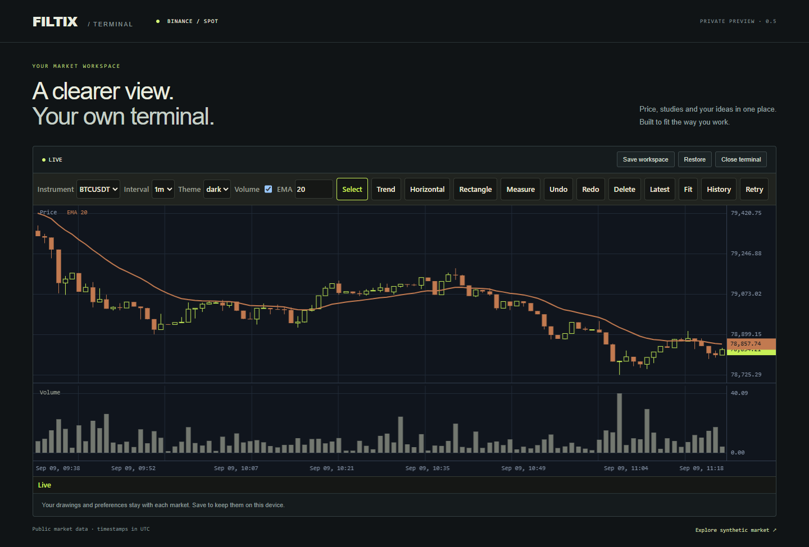

# FILTIX Charts v0.5.0

Status: accepted private local release, 2026-09-09. Release tag: v0.5.0. Source commit: 43026a088bb01caab853e50e20be553e602a44d4.

The optional @filtix/terminal package embeds a financial workspace with live candles, volume, EMA, drawing tools and per-market workspace snapshots. The independent React application installs actual private archives using its own lockfile and demonstrates StrictMode cleanup and explicit Save/Restore. The chart renderer remains framework-independent and its runtime bytes are unchanged from v0.4.

## Final candidate checks

| Check | Result |
| --- | --- |
| Unit tests | 168 passed in 14 files |
| Browser regression matrix | 321 passed across Chromium, Firefox and WebKit; 5.1 minutes |
| Packages | Eight ESM/declaration builds, strict TypeScript, formatting, SSR and NodeNext checks passed |
| Independent React installation | Eight copied archives; all 32 archive members byte-matched; strict types, production build and SSR imports passed |
| Final source review | All five complete-branch findings closed; integration guide accepted independently |
| Final native short preflight | Passed; 138,616 ms actual session, 65,096 ms background-to-recovery measurement, full data/EMA oracles and owned cleanup |
| Real one-hour scenario | Passed: 3,609,822 ms actual session, 75 checkpoints, both native background recoveries and all cleanup gates |

The final installed candidate is recorded in [consumer-install-2026-09-09T11-10-38-001Z.json](../../SOURCE-DISTRIBUTION.md#omitted-development-materials). Package contents and sizes are recorded in [v0.5-packages.json](../../SOURCE-DISTRIBUTION.md#omitted-development-materials). The [independent review archive](../../SOURCE-DISTRIBUTION.md#omitted-development-materials) preserves the original findings, corrective reviews and their evidence boundaries.

## Sustained session

The [completed one-hour attempt](../../SOURCE-DISTRIBUTION.md#omitted-development-materials) ran on Windows 10.0.26200, Intel Core i7-11700 and installed Chrome 153.0.8010.37. The actual session started at 2026-09-09T11:15:58.481Z and lasted **3,609,822 ms — 60 minutes 9.822 seconds**. Cleanup finished at 12:16:14.793Z; the process exited 0. Artifact SHA-256: 16b1740dd8f6a6dfc6405623e849cde86d41eb0ed5d5abc545a8c41837b0f7fd.

The source fixture reconstructs authoritative one-minute candles from elapsed wall time, with intrabar delivery every 250 ms. All 75 complete source comparisons passed. Eight checkpoints additionally checked every rendered candle, volume and EMA point; ordinary checkpoints checked four rendered points. In total, 5,112 rendered points were checked. Independent recomputation passed at absolute tolerance 1e-9; cross-runtime byte-identical synthetic generation is not claimed. The detailed audit records a one-ULP sine-rounding difference and the exact regeneration boundary. The final full snapshot contained 556 candles. Deliberately late history and stream callbacks were checked before workspace restoration could hide an incorrect overwrite.

| Sustained gate | Observed result |
| --- | --- |
| Native hidden-tab disconnects | Visibility events prove 180,050 ms and 330,077 ms hidden; background-to-recovery measurements were 180,066 ms and 330,089 ms; both retained the loaded prefix |
| Full recovery oracles | All 754 points after the first outage and all 532 after the second passed |
| First/final sampled DOM | 205 nodes and 196 listeners in both samples |
| Retained heap growth | 1,557,648 bytes, within the 12 MiB workload budget |
| Automated wheel input to settled render | 24 Playwright-dispatched inputs; p95 67 ms, below the 150 ms smoke budget |
| Foreground frame gaps | 120 samples; p95 approximately 16.8 ms |
| Narrow layout and interaction | Requested viewport 390 × 844; document client/scroll widths both 375 px, with no horizontal overflow; settings, drawing, keyboard and Save/Restore checks passed |
| Destroy and six remounts | Zero remaining canvases, active provider requests and subscriptions |
| Owned process cleanup | Terminal disposal, browser closure, owned Chrome exit and owned preview exit all passed |
| Errors and candidate identities | Zero recorded errors; all 22 identities matched at completion |

The identity set covers installed package runtimes, all eight archives, built application assets, harness, consumer lockfile and exact installation record. All 22 candidate identities matched at start and completion. Resource growth compares the first and final sampled scenes after garbage collection; transient allocations and caller-owned objects are outside that observation. The wheel measurement includes automation dispatch and two-frame settlement and does not measure physical display latency.

Three earlier short native attempts are retained:

| Attempt | Actual session | Applicability |
| --- | ---: | --- |
| [10:19 preflight](../../SOURCE-DISTRIBUTION.md#omitted-development-materials) | 138,449 ms | Earlier candidate; precedes the stronger stale-callback oracle |
| [10:31 preflight](../../SOURCE-DISTRIBUTION.md#omitted-development-materials) | 138,476 ms | Stronger stale-callback oracle and viewport interaction checks; precedes final terminal fixes |
| [11:10 preflight](../../SOURCE-DISTRIBUTION.md#omitted-development-materials) | 138,616 ms | Final frozen candidate; clears the short-run prerequisite only |

## Live data and engine smoke

The [final live probe](../../SOURCE-DISTRIBUTION.md#omitted-development-materials) passed on the final installed consumer: 500 BTCUSDT one-minute history candles, three actual Binance WebSocket kline frames, three mounted canvases and zero after destruction. This is a dated live connectivity check. The hour uses the separately labelled deterministic fixture.

The [engine smoke](../../SOURCE-DISTRIBUTION.md#omitted-development-materials) passed all 12 gates. Navigation library work measured p95 3.1 ms and p99 3.5 ms. The charts runtime is 47,730 raw bytes / 16,182 gzip bytes; SHA-256 09ffa9797f03410a9f2496485e9a3bff259351d6ddad23eb093439e9b55f3b9d. Terminal runtime: 16,754 raw bytes, SHA-256 fbc9c4589fb234e90c4eca5c1dbc2e6ab1554d2719dfc16521217aab77f94ad0, with FILTIX peer packages external. These are desktop/headless smoke measurements, not the original reference qualification or a competitor comparison.

## Integration and limits

Use the [terminal integration guide](../TERMINAL-CONTRACT.md), [working independent React application](../../examples/react-terminal/README.md), [approved specification](../../SOURCE-DISTRIBUTION.md#omitted-development-materials) and [implementation plan](../../SOURCE-DISTRIBUTION.md#omitted-development-materials).

Provider identity and UTC-millisecond time domain are fixed per instance. Catalogs support at most 32 combinations, each with at most 200 drawings and 100 active undo steps. The default 100,000-bar feed cap fails visibly; it does not silently evict old data. Reconnection recovers forward gaps and the tail overlap; arbitrary older corrections require explicit delivery. Workspace storage belongs to the host. The package never accesses localStorage implicitly.

Readiness describes the current workspace: live feed, no terminal error and an undestroyed instance. Unrelated actions cannot clear an unresolved ingestion/composition error. Market identities use collision-free string tuples, and drawing context replacement resets the selected tool and cancels pending gestures.

Generated drawing IDs now use a bounded integer cursor. Accepting/restoring drawing-20 makes the next generated ID drawing-21 even if lower numbers were never used. IDs are opaque. Exhausting the finite namespace throws DRAWING_ID_EXHAUSTED atomically; valid custom IDs still work. BigInt remains internal and documents use strings.

Desktop viewport emulation does not establish physical phone/laptop performance. Detailed workload and gate definitions are in the [performance methodology](../PERFORMANCE.md#v05-installed-terminal-sustained-smoke). The live probe is not a provider availability guarantee. All packages, commits and the v0.5.0 tag remain private and local. No publication, push or application deployment is included.

## Acceptance and local artifacts

Implementation commits are ec0145f (approved spec and package scaffold), 1844f4d (bounded drawing identities) and 43026a0 (terminal, installed consumer, integration checks and native harness). The v0.5.0 tag also includes final documentation and raw evidence. Eight local archives are in [dist/packages](../../SOURCE-DISTRIBUTION.md#omitted-development-materials). Run the [React example](../../examples/react-terminal/README.md) for integration or open the local showcase at http://127.0.0.1:5173/terminal.html.
