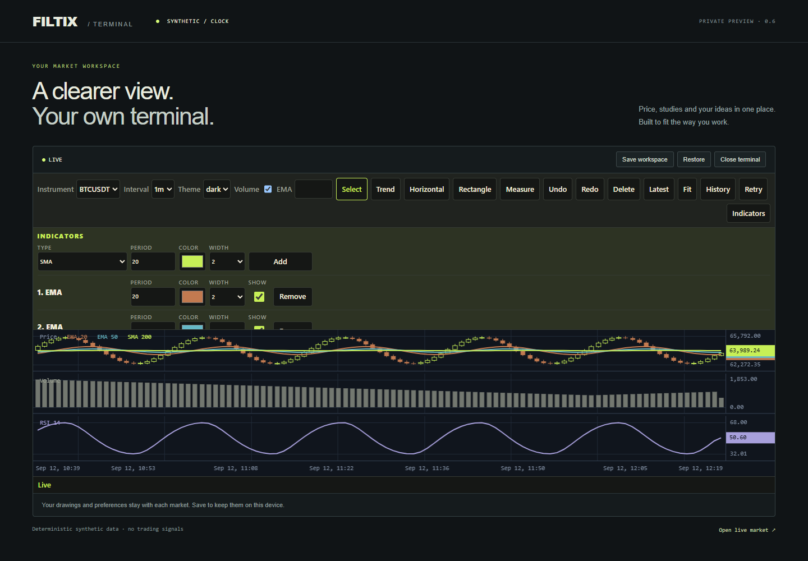

# FILTIX Charts v0.6.0

Status: accepted private local release, 2026-09-12. Delivery uses annotated tag v0.6.0.

The optional terminal now supports multiple SMA, EMA and Wilder RSI instances. The Indicators editor controls each instance's period, color, width and visibility. RSI instances receive separate panes. The showcase and independent React application start with EMA20 + EMA50 + SMA200 + RSI14. The chart engine remains framework-independent.

## Public behavior

- Store up to eight studies, including hidden instances and the reserved legacy EMA; at most three may be RSI. Volume is separate.
- Periods are integers 2..500, widths integers 1..4, and colors normalize to lowercase #RRGGBB. IDs and kinds are immutable; generated IDs are not reused within an instance.
- Hiding releases the associated chart series, calculator history and RSI pane while retaining settings. Showing rebuilds from authoritative data. Period changes recalculate the affected study; style changes and ordinary tail delivery avoid full-history reads.
- Workspace v2 stores resolved study descriptors. Strict v1 restore migrates the legacy EMA. Existing host storage keys remain; the next explicit Save writes v2.
- Invalid changes are atomic. Composition failures restore the committed workspace and remain visibly not-ready until canonical repair. Unrelated settings preserve a hidden legacy EMA.

The [integration contract](../TERMINAL-CONTRACT.md) documents addStudy, updateStudy, removeStudy, getStudies, constructor options, lifecycle and migration. The [independent React example](../../examples/react-terminal/README.md) uses real copied package archives.

## Frozen candidate identity and completed checks

Measured source commit: 3e7f8813a09e2307250ae7321010313b8bf5d729. The [exact installation record](../../SOURCE-DISTRIBUTION.md#omitted-development-materials) binds committed source to eight private archives, all 32 installed package members and every built application asset. The workload verified all 145 identities at startup and completion. The later release commit contains documentation and evidence only.

The measurement harness changed after the runtime checks; production source, regression tests and runtime bytes stayed unchanged. The final consumer verifier was rerun against the clean harness commit. The [verification record](../../SOURCE-DISTRIBUTION.md#omitted-development-materials) records 190 unit tests across 17 files, strict TypeScript, formatting, eight ESM/declaration builds, ESM/SSR/declaration consumers, and 411 browser tests: 137 each in Chromium, Firefox and WebKit. The showcase and independently installed React application build successfully. Desktop 1440 px and narrow 390 px controls were inspected; neither viewport has horizontal overflow.

| Runtime | Raw bytes | gzip level 9 bytes | SHA-256 |
| --- | ---: | ---: | --- |
| charts | 47,934 | 16,268 | 8052d49b4d4be5257912264b267d1988e0c4629322163128b58141c91e6bbc1f |
| terminal | 34,943 | 11,223 | 5681423422799e4b98c3ed80f841b4de5ebf2f9e64531422d925fc682ff422d4 |

Terminal peer packages are external to its runtime size. The charts hash changed in this release; it does not inherit the v0.5 engine identity. Archive file sizes and npm integrity values are in the [package manifest](../../SOURCE-DISTRIBUTION.md#omitted-development-materials); the installation record also contains archive/member SHA-256 hashes.

## Maximum supported composition

The [final installed all-mode attempt](../../SOURCE-DISTRIBUTION.md#omitted-development-materials) runs on Windows 10.0.26200, Intel Core i7-11700, Node22.23.2 and installed Chrome153.0.8010.37 in headless mode. Its maximum scene retains 100,000 candles, volume and eight visible studies including three RSI: ten series across five panes, with approximately 1,000 bars visible.

| Measurement | Observed | Gate |
| --- | ---: | ---: |
| Canonical rebuild synchronous p95, 3 samples | 487.4 ms | <=1,500 ms |
| Rebuild through settled rendering p95 | 496.2 ms | <=2,000 ms |
| Tail synchronous p95 / p99, 300 events | 0.9 / 1.1 ms | <=16 / 32 ms |
| Tail through settled rendering p95 / p99 | 10.1 / 12.8 ms | <=50 / 100 ms |
| Automation-inclusive wheel p95, 24 inputs | 67 ms | <150 ms |
| Foreground frame-gap p95, 120 observations | 16.8 ms | Observation only |

One warmup precedes three measured older-correction rebuilds. The tail workload includes 100 same-tail replacements at100k, then 100 appends from99,900 interleaved with100 replacements at10Hz. All source OHLCV rows and independent SMA/EMA/Wilder-RSI values at16 selected rendered timestamps pass at each of three maximum checkpoints. Warmup whitespace and pane identities are included. These are sample-based desktop results, not physical display latency, universal frame-rate guarantees or a competitor comparison.

## Sustained consumer and engine smoke

The final sustained attempt passes the explicitly amended structural ownership gate: 227,817 ms, 23 coherent checkpoints, 301 actual tail deliveries, 25 add/remove cycles and six remounts. Independent numerical oracles pass after history loading, corrections, recovery, v1 migration, v2 restore, native UI Save/Restore and the final equivalent scene. Initial and final equivalent scenes match at389 authored structural consumer nodes and344 terminal nodes. Intermediate totals reflect the selected composition (v1 migration uses186/141); outside/detached retention is zero at every settled checkpoint. All seven destroyed generations reach zero after the deliberate fixture callback is consumed and its inertness proved. Initial/final listener counts both equal252; retained heap growth is942,628 bytes against12 MiB. Raw Blink nodes1103→1104 remain an explicit diagnostic. All canvases, active requests and subscriptions are zero after teardown; owned browser and preview cleanup pass.

The raw attempt SHA-256 is dc6ce6b9c60c90d11028ffaae4dee69296208cb64b0217cecb5758a2fb9f7b12. The final source registry has97 files; with eight archives,32 installed members,six built assets,the consumer lockfile and installation record,145 identities match at both endpoints. The [engine quick/headless smoke](../../SOURCE-DISTRIBUTION.md#omitted-development-materials) passes all12 gates: navigation library work p95 3.0 ms / p99 3.3 ms, 100k ingest p95 32.5 ms and settled p95 40.9 ms. Its bundle hashes match the reviewed packages. This is a separate engine smoke, not reference or terminal-resource qualification.

## Preserved failures and corrections

The [first official attempt](../../SOURCE-DISTRIBUTION.md#omitted-development-materials) failed synchronous rebuild p95: 1,766.5 ms against the unchanged1,500 ms gate. Its numerical and tail checks passed. An independent [CPU profile](../../SOURCE-DISTRIBUTION.md#omitted-development-materials) identified repeated union-timeline collection/sorting and redundant line-run rebuilds. The engine now validates every replacement key and reuses an unchanged union while retaining range, pinning, cursor and notification bookkeeping. Changed keys retain the original fallback. Twelve new browser regression cases cover both avoided work and preserved behavior.

Three separate old-candidate functional diagnostics remain explicitly nonqualifying: [initial DOM failure](../../SOURCE-DISTRIBUTION.md#omitted-development-materials), [attribute-normalized failure](../../SOURCE-DISTRIBUTION.md#omitted-development-materials), and [corrected diagnostic pass](../../SOURCE-DISTRIBUTION.md#omitted-development-materials). They are not substitutes for the final installed run.

The DOM investigation isolated two Playwright effects: locator previews lazily materialize Blink Attr nodes; default screenshots add empty inline-style attributes while hiding carets. Resource samples now enumerate authored attributes before GC, and screenshots preserve the native caret. Neither step clears or remounts the UI. The later [second official attempt](../../SOURCE-DISTRIBUTION.md#omitted-development-materials) still failed the browser-global node gate by one node after all numerical, timing, listener and heap checks passed. A [native-only control](../../SOURCE-DISTRIBUTION.md#omitted-development-materials) and [preserved heap](../../SOURCE-DISTRIBUTION.md#omitted-development-materials) prove that Blink Editor UndoStack/TypingCommand retains old input Text nodes after native editing followed by programmatic value updates. Those browser-owned nodes exist without FILTIX or React.

The revised metric is an explicit contract correction. The authoritative weak-retention gate covers authored structural light-DOM nodes reachable through ordinary childNodes, including Element, Text, Comment and other ordinary child nodes. Standalone Attr wrappers and all shadow-tree nodes are excluded from authoritative retention. Connected attribute counts and raw Blink DOM counts remain diagnostics. Weak tracking covers the consumer and each terminal generation, including removed subtrees. Standalone Attr wrappers are excluded because same-task creation/removal is not recoverable through MutationObserver; attribute counts remain diagnostic. Require zero growth across the original equivalent first/final scenes, no retained outside/detached owned nodes, and zero terminal-generation survivors after teardown. Deliberately retained removed Text and row/Element nodes must be detected by control fixtures and return to zero after release. Total Blink node growth stays visible as a diagnostic; listener<=0, heap<=12MiB, all native UI actions and numeric/timing requirements remain unchanged. No native undo is cleared and no baseline is reset after edits.

The test provider deliberately keeps one obsolete callback after unsubscribe. Teardown records ownership before calling fixture.deliverLate(). That call consumes the deliberately held host slot and invokes its obsolete callbacks. The harness proves unchanged host DOM and transport counters immediately and after the 800 ms retry window, then requires a second delivery to return null. Only after that proof does it run the fixed collection protocol and assert zero retained structural nodes for the destroyed terminal generation. The earlier [installed ownership probe](../../SOURCE-DISTRIBUTION.md#omitted-development-materials), using the preliminary attribute-inclusive diagnostic, detects423 retained nodes before release and zero afterward. The final structural metric detects343 deliberately held terminal nodes before consumption and zero afterward. The [structural control](../../SOURCE-DISTRIBUTION.md#omitted-development-materials) detects deliberately retained Text+Element nodes and returns to zero after release; the [installed integration control](../../SOURCE-DISTRIBUTION.md#omitted-development-materials) exercises25cycles, native controls and six remounts. Their exact diagnostic sources are [preserved](../../SOURCE-DISTRIBUTION.md#omitted-development-materials). Raw [default-screenshot](../../SOURCE-DISTRIBUTION.md#omitted-development-materials) and [caret-preserving](../../SOURCE-DISTRIBUTION.md#omitted-development-materials) probes retain the evidence. The old candidate's eight archives are also [preserved separately](../../SOURCE-DISTRIBUTION.md#omitted-development-materials).

## Review and local delivery

Commits include aa55209/80ce22c for the specification and scaffold, 5dc2cfe for terminal behavior, 7b2311b for the consumer/workload, fffd44a for the measured engine correction, 8dae3a2 for layout and observation corrections, c7541f1 for final archive integrity, and 3e7f881 for the reviewed structural ownership harness. Eight private local archives are in [dist/packages](../../SOURCE-DISTRIBUTION.md#omitted-development-materials).

Use the [approved specification](../../SOURCE-DISTRIBUTION.md#omitted-development-materials), [implementation plan](../../SOURCE-DISTRIBUTION.md#omitted-development-materials) and [performance methodology](../PERFORMANCE.md#v06-configurable-study-workload) for reproducibility and scope. This stage does not repeat v0.5's native one-hour background qualification or qualify physical phones. The private local release includes no push, publication or application deployment.

